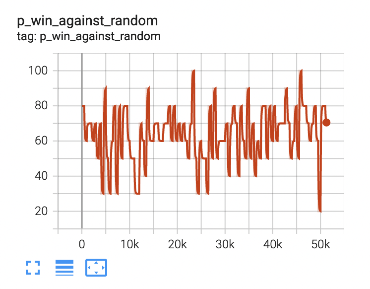
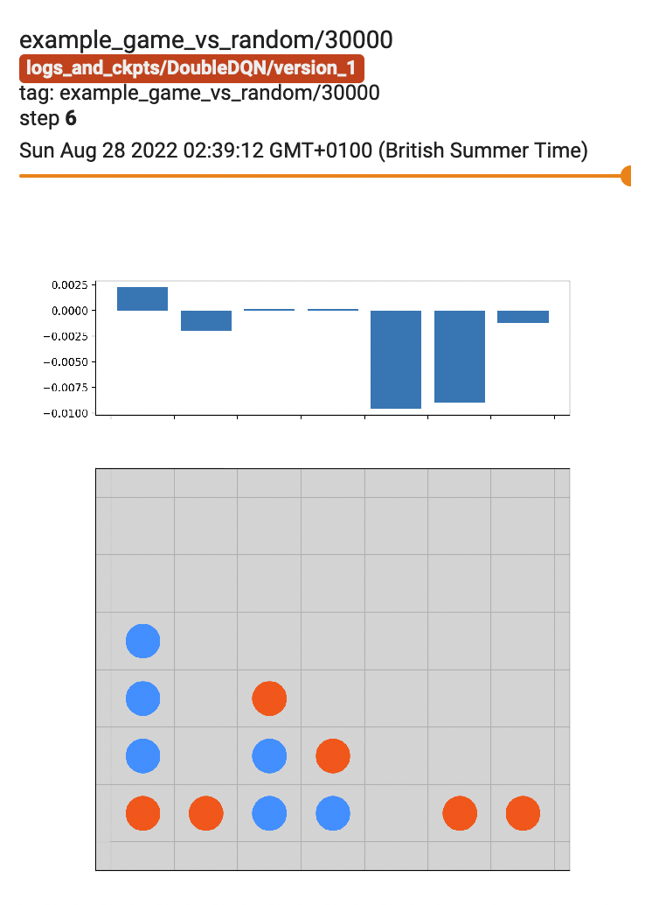
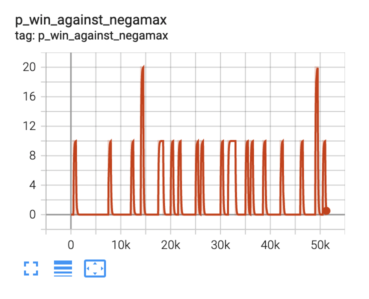
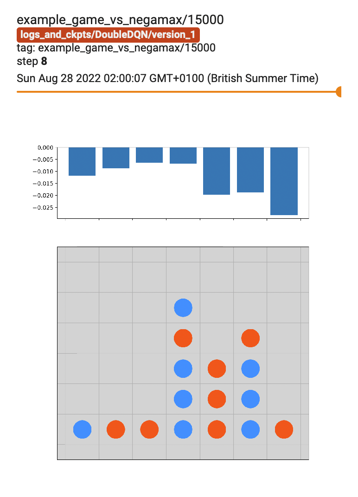

# KaggleConnect4

I implemented a few variants of Deep Q-networks ('DQN', 'DoubleDQN' and 'ExpectedSarsa') earlier this year, mainly to get some hands-on practical experience in RL, but also to play around with the apple M1 chip on my new mac. The [Kaggle Connect X challenge](https://www.kaggle.com/competitions/connectx/overview) seemed like a good place to start.

With the help of the PyTorch Lightning framework I managed to train a few models which perform consistently better than random but is helpless against the negamax algorithm -- mostly because it learns to adopt a strategy of dropping pieces into a single column

 

 

*Left: percentage of wins against opponent (out of 10 games) as training progresses*

*Right: example games against opponent, while playing blue. Bars above show estimated Q-values of the next move*

Since the main objective behind this exercise was to get to grips with practical implementations of some basic RL algorithms in order to consolidate my understanding, I didn't attempt to do any further hypertuning / try out approaches such as Monte Carlo tree search.
